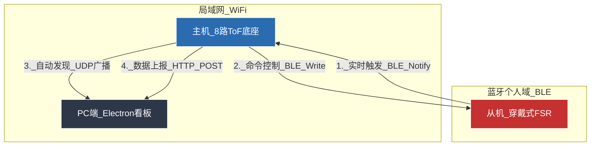

# SEBT 平衡测试系统 - 项目背景与架构文档

## 📋 项目概述

SEBT (Smart Electronic Balance Testing) 平衡测试系统是一个基于 **中心化边缘计算** 架构的智能平衡评估平台。该系统采用 **主机-从机-服务端** 三层架构，通过 **Wi-Fi + BLE** 混合网络实现实时数据采集、处理和可视化。

### 🎯 项目目标
- **精准测量**：通过ToF传感器精确测量人体平衡测试中的距离数据
- **实时反馈**：毫秒级响应，为用户提供即时平衡状态反馈
- **自动化测试**：全自动化的平衡测试流程，无需人工干预
- **数据可视化**：直观的PC端仪表板，实时显示测试结果和历史记录

---

## 🏗️ 系统架构

### 1. 系统拓扑图 (System Topology)



### 2. 设备角色定义

| 设备角色 | 职责描述 | 通信技术 | 核心功能 |
|---------|---------|---------|---------|
| **PC端-服务器** | 1. UDP监听：接收主机广播发现设备<br>2. HTTP Server：接收并展示数据<br>3. UI看板：可视化、日志记录 | Wi-Fi (HTTP) | 数据接收、可视化展示 |
| **主机-中枢** | 1. 扫描者：读取8个ToF数据，锁定方向<br>2. 协调者：连接从机，发送准备命令<br>3. 上传者：将最终结果发给PC | Wi-Fi + BLE | 数据采集、设备协调 |
| **从机-感知器** | 1. 检测者：监测脚尖触地压力<br>2. 触发者：一旦触地成功，通知主机 | BLE | 压力检测、触发信号 |

---

## 🔄 详细交互时序 (The Logic Flow)

### 测试流程概述
系统采用 **闭环测试流程**，分为 **启动、锁定、测量、上报** 四个阶段，形成完整的平衡测试闭环。

### 阶段一：系统启动与握手 (Boot & Handshake)

1. **PC启动**：Electron应用打开，开启3000端口和4210 UDP端口监听
2. **主机启动**：ESP32上电，亮红灯
3. **连网**：连接随身Wi-Fi，通过UDP广播向PC发送自身信息
4. **连蓝牙**：扫描并连接从机(FSR)，订阅从机的Notify特征值
5. **从机启动**：上电，进入待机模式，等待主机连接

### 阶段二：方向锁定 (Target Locking)

1. **用户动作**：用户单脚站立，另一只脚伸向某个方向（如"前/Front"）
2. **主机逻辑**：主机高速轮询8个ToF传感器
3. **发现目标**：发现Front方向读数为最小值
4. **计时确认**：如果该状态持续0.5秒(500ms)
5. **锁定确认**：主机进入PREPARING状态，亮蓝灯
6. **发送指令**：主机通过BLE向从机写入指令`CMD_PREPARE`(0x01)
7. **从机响应**：收到指令，激活FSR检测逻辑

### 阶段三：协同测量 (Collaborative Measuring)

1. **用户动作**：用户脚尖轻轻触地，保持平衡
2. **从机逻辑**：检测到压力稳定达标（如>2秒），通过BLE发送通知`NOTIFY_MEASURE`(0x01)
3. **主机逻辑**：收到从机通知，开始校验
4. **计时窗口**：开启3秒倒计时窗口
5. **数据监测**：在此3秒内，主机持续监测目标方向的ToF距离
6. **防作弊检测**：如果距离突变超过200mm，判定失败（亮红灯，回退到阶段二）
7. **成功判定**：如果3秒结束且数据稳定，判定成功

### 阶段四：数据上报 (Data Upload)

1. **主机动作**：亮绿灯
2. **数据打包**：`{ "direction": "F", "distance": 850 }`
3. **数据发送**：通过HTTP POST发送到`http://sebt-server.local:3000/upload`
4. **PC响应**：收到JSON数据，Electron界面上对应方块高亮显示
5. **日志记录**：记录测试数据和时间戳
6. **循环重置**：主机发送完毕后，亮红灯，重新开始扫描下一个方向

---

## 📡 通信协议 (Protocol Reference)

### A. Host → PC (HTTP POST)

**请求地址**: `http://sebt-server.local:3000/upload` 或 `http://[PC_IP]:3000/upload`

**请求方法**: POST

**Content-Type**: `application/json`

**请求体格式**:
```json
{
  "direction": "F",        // 方向代码: L, BL, FL, F, B, BR, FR, R
  "distance": 850,         // 距离值 (毫米)
  "device_id": "HOST_01",  // (可选) 设备ID
  "timestamp": 1640995200  // (可选) 时间戳
}
```

**响应格式**:
```json
{
  "success": true,
  "message": "数据接收成功"
}
```

### B. Host ↔ Slave (BLE通信)

**服务UUID**: `4fafc201-1fb5-459e-8fcc-c5c9c331914b` (示例)

**主机发送指令 (Write)**:
- `0x01`: `CMD_PREPARE` - 告诉从机：方向已锁定，开始测压力
- `0x02`: `CMD_RESET` - 告诉从机：出错了/重置，停止检测

**从机发送通知 (Notify)**:
- `0x01`: `NOTIFY_MEASURE` - 告诉主机：脚尖触地成功，可以记录距离

---

## 🔧 硬件配置

### 主机 (ESP32 ToF底座)
- **MCU**: ESP32-WROOM-32
- **传感器**: 8路ToF距离传感器 (VL53L0X/VL53L1X)
- **通信**: Wi-Fi + BLE双模
- **供电**: 5V USB供电
- **指示灯**: RGB三色灯 (红/蓝/绿状态指示)

### 从机 (FSR压力传感器)
- **传感器**: 力敏电阻(FSR)压力传感器
- **通信**: BLE (Peripheral模式)
- **供电**: CR2032电池
- **触发阈值**: 可配置压力阈值 (>2秒稳定压力)

### PC端 (数据看板)
- **框架**: Electron + HTML/CSS/JavaScript
- **服务器**: Express.js (端口3000)
- **发现**: UDP广播设备发现
- **界面**: 3x3网格布局 + 实时日志

---

## 📊 数据流向

### 1. 传感器数据流
```
FSR压力检测 → BLE通知 → ESP32主机接收 → Wi-Fi上传 → PC服务器 → UI更新
```

### 2. 控制命令流
```
PC界面操作 → HTTP请求 → ESP32主机 → BLE指令 → FSR设备响应
```

### 3. 状态同步流
```
ESP32状态变化 → 多彩LED指示 → 用户视觉反馈
```

---

## 🚀 当前开发阶段 (Current Phase)

### 阶段状态: **Testing Host via PC**

由于当前从机(FSR设备)存在技术问题暂时无法正常工作，因此采用**临时测试方案**：

#### 临时逻辑
1. **主机职责**：只负责扫描和锁定方向 (亮蓝灯表示锁定成功)
2. **PC端增强**：添加"模拟触发"按钮
3. **交互流程**：
   - 主机锁定方向并亮蓝灯时，实际在等待从机的BLE信号
   - 通过PC端的"模拟触发"按钮发送额外指令进行临时测试
   - 跳过真实的FSR压力检测环节

#### 测试目标
- ✅ 验证ToF传感器的8方向扫描功能
- ✅ 验证方向锁定算法的准确性
- ✅ 验证Wi-Fi连接和数据上传功能
- ✅ 验证PC端的数据接收和UI显示
- 🔄 验证BLE连接和命令发送 (待FSR设备修复后)

#### 下一步计划
1. 修复FSR设备BLE通信问题
2. 实现完整的Host-Slave协同测试
3. 添加测试数据统计和分析功能
4. 优化UI交互和用户体验

---

## 📝 开发日志

### 2025-01-XX
- ✅ 完成PC端Electron应用开发
- ✅ 实现3x3网格UI布局和数据可视化
- ✅ 集成Express服务器和UDP设备发现
- ✅ 实现HTTP数据接收和实时显示
- 🔄 主机ESP32开发中 (ToF传感器集成)
- ⏳ 从机FSR设备开发中 (BLE通信)

### 技术栈
- **前端**: HTML/CSS/JavaScript + Electron
- **后端**: Node.js + Express
- **网络**: HTTP RESTful API + UDP设备发现
- **硬件**: ESP32 (Wi-Fi/BLE) + ToF传感器 + FSR传感器

---

*本文档持续更新，记录SEBT系统的完整开发历程和技术细节。*
