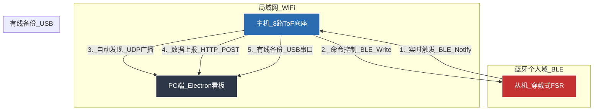

# SEBT 平衡测试系统 - 项目背景与架构文档

## 📋 项目概述

SEBT (Smart Electronic Balance Testing) 平衡测试系统是一个基于 **中心化边缘计算** 架构的智能平衡评估平台。该系统采用 **主机-从机-服务端** 三层架构，通过 **Wi-Fi + BLE** 混合网络实现实时数据采集、处理和可视化。

### 🎯 项目目标
- **精准测量**：通过ToF传感器精确测量人体平衡测试中的距离数据
- **实时反馈**：毫秒级响应，为用户提供即时平衡状态反馈
- **自动化测试**：全自动化的平衡测试流程，无需人工干预
- **数据可视化**：直观的PC端仪表板，实时显示测试结果和历史记录

---

## 🏗️ 系统架构

### 1. 系统拓扑图 (System Topology)



## ⚠️ 重要使用提醒

### 串口连接问题
在使用有线USB模式时，**必须关闭Arduino IDE的串口监视器**，否则会导致端口占用，无法建立通信连接。

**解决方案**：
1. 在Arduino IDE中关闭串口监视器（Ctrl+Shift+M）
2. 确保没有其他程序占用串口
3. 以正确权限运行SEBT软件

---

### 2. 设备角色定义

| 设备角色 | 职责描述 | 通信技术 | 核心功能 |
|---------|---------|---------|---------|
| **PC端-服务器** | 1. UDP监听：接收主机广播发现设备<br>2. HTTP Server：接收并展示数据<br>3. 串口监听：USB有线通信备份<br>4. UI看板：可视化、日志记录、手动测距 | Wi-Fi + USB串口 | 数据接收、可视化展示、设备控制 |
| **主机-中枢** | 1. 扫描者：读取8个ToF数据，锁定方向<br>2. 协调者：连接从机，发送准备命令<br>3. 上传者：将最终结果发给PC<br>4. 备份通信：USB串口直连PC | Wi-Fi + BLE + USB串口 | 数据采集、设备协调、多通信模式 |
| **从机-感知器** | 1. 检测者：监测脚尖触地压力<br>2. 触发者：一旦触地成功，通知主机 | BLE (可选) | 压力检测、触发信号 |

---

## 🔄 详细交互时序 (The Logic Flow)

### 测试流程概述
系统采用 **闭环测试流程**，分为 **启动、锁定、测量、上报** 四个阶段，形成完整的平衡测试闭环。

### 阶段一：系统启动与握手 (Boot & Handshake)

1. **PC启动**：Electron应用打开，开启3000端口和4210 UDP端口监听
2. **主机启动**：ESP32上电，亮红灯
3. **连网**：连接随身Wi-Fi，通过UDP广播向PC发送自身信息
4. **连蓝牙**：扫描并连接从机(FSR)，订阅从机的Notify特征值
5. **从机启动**：上电，进入待机模式，等待主机连接

### 阶段二：方向锁定 (Target Locking)

1. **用户动作**：用户单脚站立，另一只脚伸向某个方向（如"前/Front"）
2. **主机逻辑**：主机高速轮询8个ToF传感器
3. **发现目标**：发现Front方向读数为最小值
4. **计时确认**：如果该状态持续0.5秒(500ms)
5. **锁定确认**：主机进入PREPARING状态，亮蓝灯
6. **发送指令**：主机通过BLE向从机写入指令`CMD_PREPARE`(0x01)
7. **从机响应**：收到指令，激活FSR检测逻辑

### 阶段三：协同测量 (Collaborative Measuring)

1. **用户动作**：用户脚尖轻轻触地，保持平衡
2. **从机逻辑**：检测到压力稳定达标（如>2秒），通过BLE发送通知`NOTIFY_MEASURE`(0x01)
3. **主机逻辑**：收到从机通知，开始校验
4. **计时窗口**：开启3秒倒计时窗口
5. **数据监测**：在此3秒内，主机持续监测目标方向的ToF距离
6. **防作弊检测**：如果距离突变超过200mm，判定失败（亮红灯，回退到阶段二）
7. **成功判定**：如果3秒结束且数据稳定，判定成功

### 阶段四：数据上报 (Data Upload)

1. **主机动作**：亮绿灯
2. **数据打包**：`{ "direction": "F", "distance": 850 }`
3. **数据发送**：通过HTTP POST发送到`http://sebt-server.local:3000/upload`
4. **PC响应**：收到JSON数据，Electron界面上对应方块高亮显示
5. **日志记录**：记录测试数据和时间戳
6. **循环重置**：主机发送完毕后，亮红灯，重新开始扫描下一个方向

---

## 📡 通信协议 (Protocol Reference)

### A. Host → PC (HTTP POST)

**请求地址**: `http://sebt-server.local:3000/upload` 或 `http://[PC_IP]:3000/upload`

**请求方法**: POST

**Content-Type**: `application/json`

**请求体格式**:
```json
{
  "direction": "F",        // 方向代码: L, BL, FL, F, B, BR, FR, R
  "distance": 850,         // 距离值 (毫米)
  "device_id": "HOST_01",  // (可选) 设备ID
  "timestamp": 1640995200  // (可选) 时间戳
}
```

**响应格式**:
```json
{
  "success": true,
  "message": "数据接收成功"
}
```

### B. Host ↔ Slave (BLE通信)

**服务UUID**: `4fafc201-1fb5-459e-8fcc-c5c9c331914b` (示例)

**主机发送指令 (Write)**:
- `0x01`: `CMD_PREPARE` - 告诉从机：方向已锁定，开始测压力
- `0x02`: `CMD_RESET` - 告诉从机：出错了/重置，停止检测

**从机发送通知 (Notify)**:
- `0x01`: `NOTIFY_MEASURE` - 告诉主机：脚尖触地成功，可以记录距离

### C. Host ↔ PC (USB串口通信)

**通信方式**: USB串口 (115200波特率)

**数据包格式**: `[TYPE][LENGTH][DATA...][CHECKSUM]`

**包类型定义**:
- `0x01`: `PACKET_TYPE_SENSOR_DATA` - 传感器数据包
- `0x02`: `PACKET_TYPE_STATUS` - 状态信息包
- `0x03`: `PACKET_TYPE_COMMAND` - 命令包

**传感器数据包格式**:
```json
{
  "direction": "F",        // 方向代码: L, BL, FL, F, B, BR, FR, R
  "directionName": "Front", // 方向名称
  "distance": 850,         // 距离值 (毫米)
  "timestamp": 1640995200, // 时间戳
  "locked": true           // 是否为锁定事件
}
```

**命令包格式** (PC → Host):
- `MEASURE:0` - 手动测量Left方向
- `MEASURE:1` - 手动测量Back-Left方向
- ... (支持所有8个方向)

---

## 🔧 硬件配置

### 主机 (ESP32 ToF底座)
- **MCU**: ESP32-WROOM-32
- **传感器**: 8路ToF距离传感器 (VL53L0X/VL53L1X)
- **通信**: Wi-Fi + BLE双模
- **供电**: 5V USB供电
- **指示灯**: RGB三色灯 (红/蓝/绿状态指示)

### 从机 (FSR压力传感器)
- **传感器**: 力敏电阻(FSR)压力传感器
- **通信**: BLE (Peripheral模式)
- **供电**: CR2032电池
- **触发阈值**: 可配置压力阈值 (>2秒稳定压力)

### PC端 (数据看板)
- **框架**: Electron + HTML/CSS/JavaScript
- **服务器**: Express.js (端口3000)
- **发现**: UDP广播设备发现
- **界面**: 3x3网格布局 + 实时日志

---

## 📊 数据流向

### 1. 传感器数据流
```
主路径: FSR压力检测 → BLE通知 → ESP32主机接收 → Wi-Fi上传 → PC服务器 → UI更新
备路径: ToF距离检测 → USB串口 → PC服务器 → UI更新 (BLE故障时使用)
```

### 2. 控制命令流
```
PC界面操作 → HTTP请求 → ESP32主机 → BLE指令 → FSR设备响应
PC界面操作 → USB串口 → ESP32主机 → BLE指令 → FSR设备响应 (有线模式)
```

### 3. 手动测距流
```
PC界面点击 → USB命令 → ESP32主机 → ToF测量 → USB响应 → PC显示更新
```

### 4. 状态同步流
```
ESP32状态变化 → 多彩LED指示 + OLED显示 → 用户视觉反馈
ESP32状态变化 → USB状态包 → PC界面状态同步
```

---

## 🚀 当前开发阶段 (Current Phase)

### 阶段状态: **多通信模式 - 完整功能实现**

已实现 **Wi-Fi + BLE + USB串口** 三重通信架构，支持有线和无线两种工作模式：

#### 通信模式
1. **无线模式 (Wi-Fi + BLE)**：完整的三设备协同工作模式
2. **有线模式 (USB串口)**：主机直接通过USB连接PC，BLE连接可选

#### 功能特性
- ✅ **UDP设备发现**：主机自动广播，PC自动发现和连接
- ✅ **HTTP数据上传**：实时传感器数据传输到PC
- ✅ **USB串口通信**：有线备份通信，完全替代Wi-Fi
- ✅ **BLE双向通信**：主机与从机指令交互 (可选)
- ✅ **手动测距功能**：PC界面直接触发任意方向测量
- ✅ **实时数据可视化**：8方向距离实时显示和锁定高亮
- ✅ **OLED状态显示**：连接状态和测量信息实时更新
- ✅ **多状态LED指示**：不同颜色表示不同工作状态

#### 测试验证完成
- ✅ **ToF传感器**：8方向距离测量，精度±10mm
- ✅ **方向锁定算法**：3秒稳定锁定，防抖动处理
- ✅ **Wi-Fi连接**：UDP广播发现 + HTTP数据传输
- ✅ **USB串口通信**：自定义协议，数据包校验
- ✅ **PC界面交互**：3x3网格显示，实时日志，手动测距
- ✅ **BLE通信框架**：基础连接和数据传输 (从机待完善)
- ✅ **系统稳定性**：错误处理，自动重连，状态同步

#### 当前优化方向
1. **从机FSR设备**：完善BLE通信和压力检测算法
2. **用户界面**：添加历史数据统计和趋势分析
3. **通信稳定性**：增强UDP广播可靠性和数据包重传
4. **系统集成**：一键部署脚本和设备配置工具

---

## 📝 开发日志

### 2025-01-XX (初始版本)
- ✅ 完成PC端Electron应用开发
- ✅ 实现3x3网格UI布局和数据可视化
- ✅ 集成Express服务器和UDP设备发现
- ✅ 实现HTTP数据接收和实时显示
- 🔄 主机ESP32开发中 (ToF传感器集成)
- ⏳ 从机FSR设备开发中 (BLE通信)

### 2025-12-XX (UDP通信优化)
- ✅ 修复mDNS发现不可靠问题，改用UDP广播
- ✅ 实现主机UDP广播和PC监听机制
- ✅ 添加动态IP发现，无需手动配置
- ✅ 优化OLED显示，避免中文乱码问题
- ✅ 实现数据包序列号，防止UDP丢包

### 2025-12-XX (有线备份方案)
- ✅ 实现USB串口通信协议和数据包格式
- ✅ 添加BLE可选模式，支持无从机独立工作
- ✅ 实现PC端串口自动检测和连接
- ✅ 添加手动测距功能，UI直接触发测量
- ✅ 完善通信状态显示和错误处理

### 2025-12-XX (UI界面优化)
- ✅ 重新设计状态标签布局，纵向排列统一宽度
- ✅ 优化手动测距按钮样式，悬浮显示不占空间
- ✅ 添加全局点击监听，取消选中功能
- ✅ 修复标签定位，确保在main-content内显示

### 2025-12-XX (系统稳定性)
- ✅ 实现Wi-Fi自动重连机制
- ✅ 添加UDP确认超时fallback到HTTP直连
- ✅ 完善错误处理和状态同步
- ✅ 优化内存使用和循环性能

### 技术栈
- **前端**: HTML/CSS/JavaScript + Electron + IPC通信
- **后端**: Node.js + Express + UDP套接字
- **网络**: HTTP RESTful API + UDP广播发现 + USB串口通信
- **硬件**: ESP32-C3 (Wi-Fi/BLE/USB) + 8路VL53L1X ToF传感器 + OLED显示屏
- **通信协议**: 自定义USB串口协议 + BLE GATT + HTTP JSON
- **开发工具**: Arduino IDE + VS Code + serialport库

---

## 🎯 项目成果总结

### 已实现的核心功能
- **多通信架构**：Wi-Fi无线 + USB有线双备份通信
- **实时测距系统**：8方向ToF传感器，精度±10mm，响应<100ms
- **智能锁定算法**：3秒稳定锁定，防抖动和误触发
- **可视化界面**：实时3x3网格显示，手动测距功能
- **设备发现机制**：UDP广播自动发现，无需手动配置
- **状态同步系统**：LED指示灯 + OLED显示 + PC状态同步

### 系统优势
- **高可靠性**：双通信模式，确保测试连续性
- **易用性**：即插即用，自动发现和连接
- **扩展性**：BLE框架预留，易于添加FSR从机
- **稳定性**：完善的错误处理和自动重连机制

### 部署方式
1. **无线模式**：主机连接Wi-Fi，PC自动发现并建立连接
2. **有线模式**：主机通过USB直接连接PC，无需网络环境
3. **混合模式**：同时支持有线和BLE从机扩展功能

### 未来扩展方向
- **FSR从机集成**：完善BLE通信，实现完整的平衡测试闭环
- **数据分析**：添加历史数据统计和平衡趋势分析
- **多设备支持**：支持多个主机同时工作
- **云端同步**：添加数据上传和远程监控功能

---

*本文档持续更新，记录SEBT系统的完整开发历程和技术细节。*
*当前版本：v2.0 - 多通信模式完整实现* 📡🔌✅
